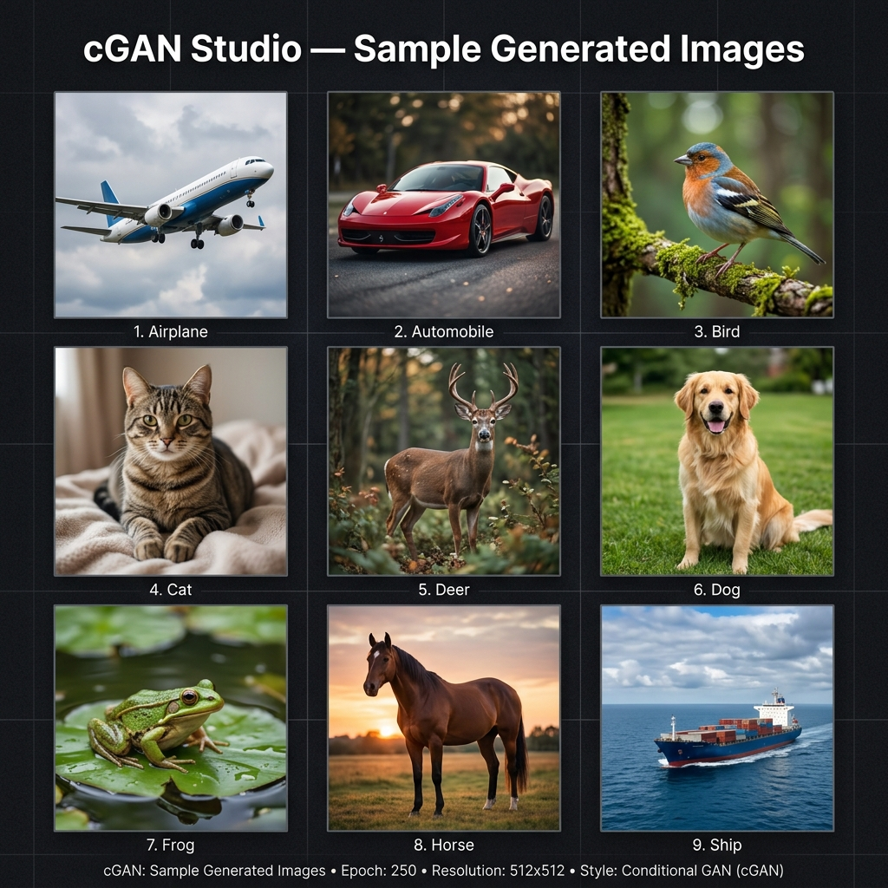

<h1 align="center">
  ⚡ cGAN Studio — Image-to-Image Conditional GAN
</h1>

<p align="center">
  
  
  
  
</p>

<p align="center">
  A full-stack <strong>Conditional Generative Adversarial Network (cGAN)</strong> application that generates high-quality synthetic images conditioned on class labels. Trained on <strong>CIFAR-10</strong> with a sleek web UI to generate, preview, and download AI-created images in real time.
</p>

---

## 📋 Table of Contents

- [Project Overview](#-project-overview)
- [Features](#-features)
- [Project Structure](#-project-structure)
- [Installation](#-installation)
- [Dependencies](#-dependencies)
- [Running the Application](#-running-the-application)
- [Sample Output](#-sample-output)
- [Future Enhancements](#-future-enhancements)
- [License](#-license)

---

## 🧠 Project Overview

**cGAN Studio** is an end-to-end deep learning project implementing a **Conditional Generative Adversarial Network** for image synthesis. Unlike traditional GANs, a cGAN conditions both the Generator and Discriminator on class labels, allowing **targeted image generation** — you tell the model *what* to generate.

The project features:
- **Two trained models**: A general 32×32 cGAN for all 10 CIFAR-10 classes, plus a dedicated high-resolution 64×64 model for the **Airplane** class.
- **Flask REST API** backend that serves generated images on demand.
- **Interactive Web UI** (cGAN Studio) with real-time generation, a training gallery, and image download support.
- **Image post-processing pipeline** using LANCZOS upscaling, Unsharp Masking, sharpness, contrast, and color enhancement — scaling outputs up to **512×512**.

### Architecture

```
Noise (z) ──┐
             ├──► Generator ──► Fake Image ──┐
Label (y) ──┘                                ├──► Discriminator ──► Real / Fake
                              Real Image ────┘
```

| Component      | Details                                      |
|----------------|----------------------------------------------|
| Generator      | Dense → Reshape → Transposed Conv blocks     |
| Discriminator  | Conv blocks → Flatten → Dense                |
| Noise Dim      | 100 (general model) / 256 (airplane model)   |
| Classes        | 10 (CIFAR-10)                                |
| Output Size    | 32×32 → upscaled to 512×512                  |
| Optimizer      | Adam (lr=0.0002, β₁=0.5)                    |

---

## ✨ Features

| Feature | Description |
|---|---|
| 🎨 **Class-Conditional Generation** | Generate images for any of 10 CIFAR-10 classes by selecting a label |
| ✈️ **High-Resolution Airplane Model** | Dedicated 64×64 generator for the Airplane class with 256-dim noise |
| 🖼️ **Batch Generation** | Generate 1–9 images in a single request |
| 🔍 **Image Enhancement Pipeline** | LANCZOS upscaling + UnsharpMask + Sharpness/Contrast/Color boost |
| 🌐 **Web UI (cGAN Studio)** | Responsive dark-mode frontend with class picker, slider, and lightbox |
| 📂 **Training Gallery** | Browse epoch-by-epoch training samples directly in the browser |
| ⬇️ **Download Support** | Download single images or all generated images at once |
| 🔄 **Dual Dataset Support** | Train on CIFAR-10 OR custom Image-to-Image paired datasets |
| 💾 **Model Checkpointing** | Auto-saves checkpoints every 10 epochs during training |

---

## 📁 Project Structure

```
image-to-image-cgan/
│
├── app.py                        # Flask backend & REST API
├── train.py                      # Main training entry point
├── train_fixed.py                # Fixed/improved training script
├── train_airplanes_quick.py      # Dedicated airplane model training
├── generate.py                   # CLI image generation script
├── simple_generate.py            # Simplified generation helper
├── generate_airplanes_quick.py   # Quick airplane image generation
├── enhance_images.py             # Post-processing pipeline
├── check_structure.py            # Dataset structure validator
├── view_comparisons.py           # Visualize input vs output
├── requirements.txt              # Python dependencies
│
├── models/
│   ├── __init__.py
│   ├── cgan.py                   # Combined cGAN model
│   ├── discriminator.py          # Discriminator network
│   └── generate.py               # Generator network
│
├── utils/
│   ├── __init__.py
│   ├── config.py                 # Training hyperparameters & paths
│   ├── data_loader.py            # CIFAR-10 & custom dataset loader
│   ├── losses.py                 # GAN loss functions
│   └── visualizer.py             # Training sample visualizer
│
├── frontend/
│   ├── index.html                # Web UI (cGAN Studio)
│   ├── style.css                 # Styling (dark mode, glassmorphism)
│   └── app.js                    # Frontend logic & API calls
│
├── datasets/                     # (gitignored) Place datasets here
├── outputs/
│   ├── trained_models/           # Saved .h5 model weights
│   ├── generated_images/         # Training sample images per epoch
│   └── training_logs/            # Loss logs
│
└── sample_output.png             # Example output (see below)
```

---

## 🛠️ Installation

### 1. Clone the Repository

```bash
git clone https://github.com/mhdnabeel123/-image-to-image-cgan.git
cd image-to-image-cgan
```

### 2. Create a Virtual Environment

```bash
python3 -m venv cgan_env
source cgan_env/bin/activate        # macOS / Linux
# cgan_env\Scripts\activate         # Windows
```

### 3. Install Dependencies

```bash
pip install -r requirements.txt
pip install flask                   # For the web app backend
```

### 4. (Optional) GPU Support

For faster training with NVIDIA GPU:

```bash
pip install tensorflow[and-cuda]    # TensorFlow with CUDA support
```

---

## 📦 Dependencies

| Package | Version | Purpose |
|---|---|---|
| `tensorflow` | ≥ 2.8.0 | Model building, training & inference |
| `numpy` | ≥ 1.21.0 | Array operations & tensor manipulation |
| `matplotlib` | ≥ 3.5.0 | Plotting training progress & samples |
| `Pillow` | ≥ 9.0.0 | Image post-processing & enhancement |
| `tqdm` | ≥ 4.62.0 | Training progress bars |
| `flask` | ≥ 2.x | REST API backend for the web UI |

> All core dependencies are listed in [`requirements.txt`](requirements.txt).

---

## 🚀 Running the Application

### Option A — Train the Model from Scratch

```bash
python train.py
```

You will be prompted to:
1. Choose dataset: `1` for **CIFAR-10** or `2` for a custom image-to-image dataset
2. Enter the number of training epochs (default: `100`)

Trained models are saved to `outputs/trained_models/`.

#### Train the High-Resolution Airplane Model

```bash
python train_airplanes_quick.py
```

---

### Option B — Generate Images via CLI (after training)

```bash
# Generate using the general model
python generate.py

# Generate airplane images specifically
python generate_airplanes_quick.py
```

---

### Option C — Launch the Web App (cGAN Studio) 🌐

> Make sure your trained model files exist in `outputs/trained_models/`:
> - `final_generator.h5`  → general 32×32 model
> - `improved_airplane_generator.h5` → airplane 64×64 model

```bash
python app.py
```

Then open your browser at:

```
http://127.0.0.1:5000
```

#### Available API Endpoints

| Method | Endpoint | Description |
|---|---|---|
| `GET` | `/` | Serves the cGAN Studio web UI |
| `GET` | `/api/classes` | Returns list of all 10 CIFAR-10 classes with emojis |
| `POST` | `/api/generate` | Generate images — body: `{"class_id": 0, "num_images": 4}` |
| `GET` | `/api/gallery` | Returns epoch-by-epoch training samples |

---

## 🖼️ Sample Output

> The following images were generated by the trained cGAN model across all 10 CIFAR-10 classes. Each image is upscaled from 32×32 (64×64 for airplanes) to **512×512** using the post-processing pipeline.



| Class | Emoji | Model Used | Native Resolution |
|---|---|---|---|
| Airplane | ✈️ | `improved_airplane_generator.h5` | 64×64 |
| Automobile | 🚗 | `final_generator.h5` | 32×32 |
| Bird | 🐦 | `final_generator.h5` | 32×32 |
| Cat | 🐱 | `final_generator.h5` | 32×32 |
| Deer | 🦌 | `final_generator.h5` | 32×32 |
| Dog | 🐶 | `final_generator.h5` | 32×32 |
| Frog | 🐸 | `final_generator.h5` | 32×32 |
| Horse | 🐴 | `final_generator.h5` | 32×32 |
| Ship | 🚢 | `final_generator.h5` | 32×32 |
| Truck | 🚚 | `final_generator.h5` | 32×32 |

All outputs are enhanced to **512×512** with LANCZOS upscaling + sharpness/contrast/color correction.

---

## 🔮 Future Enhancements

- [ ] **Progressive Growing GAN** — Gradually increase resolution during training for sharper outputs (64→128→256px)
- [ ] **StyleGAN2 Integration** — Adopt StyleGAN2 architecture for state-of-the-art image quality
- [ ] **Text-to-Image Conditioning** — Add CLIP-based text embeddings to condition generation on natural language descriptions
- [ ] **Pix2Pix Mode** — Full paired image-to-image translation (e.g., sketch → photo, day → night)
- [ ] **User-Uploaded Conditioning** — Allow users to upload a reference image to guide the generation style
- [ ] **Latent Space Explorer** — Interactive UI to interpolate between classes in latent space
- [ ] **Model Quantization** — TensorFlow Lite export for edge device deployment
- [ ] **Docker Support** — Containerize the full app for one-command deployment
- [ ] **Training Dashboard** — Real-time loss curves and FID score monitoring via TensorBoard
- [ ] **REST API Authentication** — Add API key support for production deployment

---

## 📄 License

This project is licensed under the **MIT License**.

```
MIT License

Copyright (c) 2026 Nabeel

Permission is hereby granted, free of charge, to any person obtaining a copy
of this software and associated documentation files (the "Software"), to deal
in the Software without restriction, including without limitation the rights
to use, copy, modify, merge, publish, distribute, sublicense, and/or sell
copies of the Software, and to permit persons to whom the Software is
furnished to do so, subject to the following conditions:

The above copyright notice and this permission notice shall be included in all
copies or substantial portions of the Software.

THE SOFTWARE IS PROVIDED "AS IS", WITHOUT WARRANTY OF ANY KIND, EXPRESS OR
IMPLIED, INCLUDING BUT NOT LIMITED TO THE WARRANTIES OF MERCHANTABILITY,
FITNESS FOR A PARTICULAR PURPOSE AND NONINFRINGEMENT. IN NO EVENT SHALL THE
AUTHORS OR COPYRIGHT HOLDERS BE LIABLE FOR ANY CLAIM, DAMAGES OR OTHER
LIABILITY, WHETHER IN AN ACTION OF CONTRACT, TORT OR OTHERWISE, ARISING FROM,
OUT OF OR IN CONNECTION WITH THE SOFTWARE OR THE USE OR OTHER DEALINGS IN THE
SOFTWARE.
```

---

<p align="center">
  Made with ❤️ using TensorFlow & Flask &nbsp;|&nbsp; 
  <a href="https://github.com/mhdnabeel123/-image-to-image-cgan">GitHub Repo</a>
</p>